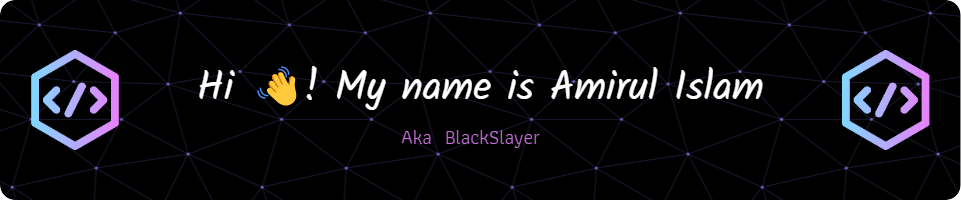

     

###

  

  
###

  
  
  
  
  
  

###

   
 <h2> 🖥️I Code With :</h2.

###

  

  
  
  
  
  
  
  
  
  
  
  
  
  
  
  
  
  

### :fire: My Stats :

  
  

###

###

 

  

   
  
🔭 I’m currently working on [Drone Survay Bangladesh](https://www.dronesurveybangladesh.com/)

🌱 I’m currently learning **Redux, Angular, Python**

👨‍💻 All of my projects are available at [https://amirul-islam-tajbid.web.app/](https://amirul-islam-tajbid.web.app/)

💬 Ask me about **React, JavaScript, C++**

📫 How to reach me **amirulislamtajbid@gmail.com**

📄 Know about my experiences [https://drive.google.com/file/d/17bEBWC0Yw5PBCjmMZySLqjgxAOvBf20E/view?usp=share_link](https://drive.google.com/file/d/17bEBWC0Yw5PBCjmMZySLqjgxAOvBf20E/view?usp=share_link)

⚡ Fun fact **I think I am Funny**
   

  

   
   ###
   
   

